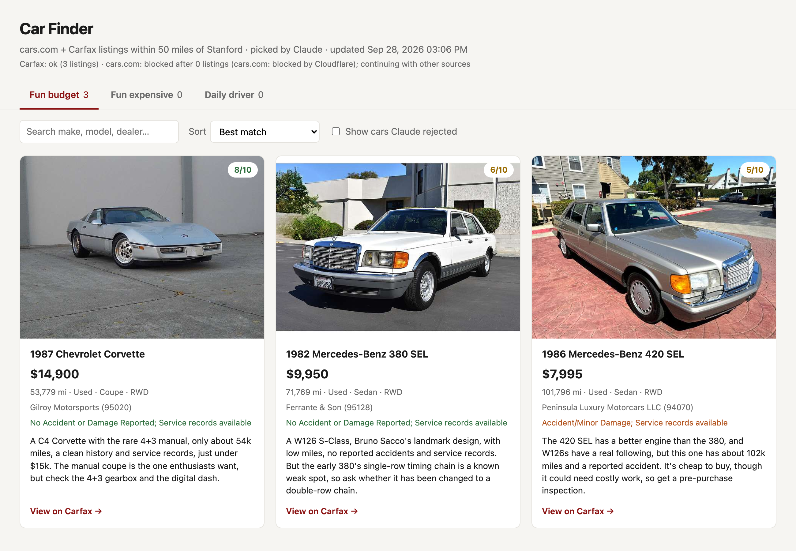

# Car Finder

**An AI-powered used-car scout.** Car Finder searches **cars.com** and **Carfax** for every listing around any US ZIP code (Stanford by default), has **Claude** judge each one against three personal buying profiles, and presents the best picks in a clean, clickable dashboard.



---

## Why

Car marketplaces are great at filtering on hard numbers (price, year, mileage) but useless at the questions that actually matter when you're shopping for fun: *Is this 1987 car a collectible or just old? Is this $110k car a real driver's car, or a heavy luxury SUV?* Car Finder uses the site filters for the numbers and an LLM for the judgment, then ranks thousands of listings down to a shortlist, so you only review the matches.

## The three buying profiles

| Profile | Hard filters | What Claude judges |
|---|---|---|
| **Fun budget** | Used, under $15k, built before 1990 | Is it interesting or does it have pedigree (a classic, a collectible, motorsport or design history)? |
| **Fun expensive** | Over $70k | Is it genuinely sporty, or really interesting for what it costs? |
| **Daily driver** | $30–50k, SUV or sedan, under 40k miles | Is it a low-mileage, practical, well-regarded SUV or 4-door sedan? |

Claude gives every listing a **fit / no-fit verdict**, a **1–10 score**, and a **one-line reason** a buyer would care about. For example:

> **1987 Chevrolet Corvette — $14,900 — 8/10**
> A C4 with the rare 4+3 manual, only ~54k miles, clean history and service records, just under $15k. The manual coupe is the one enthusiasts want, but check the 4+3 gearbox and the digital dash.

## How it works

```
             ┌────────────────┐     ┌──────────────────┐
             │   Carfax API   │     │ cars.com (Chrome │
             │ (JSON endpoint)│     │  via Playwright) │
             └───────┬────────┘     └────────┬─────────┘
                     │   per-category searches, cached  │
                     └───────────────┬──────────────────┘
                                     ▼
                  normalize → dedupe by VIN (merge links)
                                     ▼
                  hard price/year checks → Claude (batched,
                  parallel, structured JSON output, cached)
                                     ▼
                     static HTML dashboard (data/report.html)
```

### Engineering highlights

- **Two sources with automatic failover.** Each source runs independently. If one is blocked or errors out (for example, Cloudflare flags cars.com), the run continues with the other and the dashboard notes which sources succeeded. When both work, results are merged and deduped by VIN, so a car listed on both sites shows up once with a link to each.
- **Polite, resumable scraping.** Each category runs its own narrow server-side search, so the sites do the coarse filtering and far fewer pages get fetched. Page loads are spaced out with randomized delays, and every fetched page is cached to disk, so an interrupted run resumes exactly where it stopped.
- **cars.com through a real browser.** cars.com blocks plain HTTP clients and headless browsers, so it's loaded in a visible Chrome window driven by Playwright, with a persistent profile. Listing data comes from the structured JSON embedded in each result card.
- **Carfax through its JSON endpoint.** Carfax listings come from the same JSON feed its search page uses, and they include vehicle history (accidents, service records), which is passed to Claude and shown on each card.
- **LLM classification with structured output.** Listings are sent to Claude in batches of 40 through the [Claude Code](https://claude.com/claude-code) CLI in headless mode (`claude -p --json-schema ...`), so there's no API key to manage. Batches run in parallel, and verdicts are cached per listing, so reruns only classify new cars.
- **Zero-dependency dashboard.** The report is a single self-contained HTML file (vanilla JS, no build step) with category tabs, search, sorting by score, price or mileage, a toggle to show rejected cars, and links straight to each listing.

## Tech stack

Python 3.12 · Playwright · BeautifulSoup · Requests · Claude (via Claude Code CLI) · vanilla HTML/CSS/JS

## Getting started

**Requirements:** Python 3.10+, Google Chrome, and the [Claude Code](https://claude.com/claude-code) CLI, logged in.

```bash
git clone https://github.com/ArnayG/car-finder.git
cd car-finder
python3.12 -m venv .venv
source .venv/bin/activate
pip install -r requirements.txt
```

## Usage

```bash
python -m car_finder                          # scrape → classify → open the dashboard
python -m car_finder scrape                   # just scrape
python -m car_finder classify                 # classify already-scraped listings
python -m car_finder report                   # rebuild the dashboard
python -m car_finder --category fun_budget    # limit to one profile (repeatable)
python -m car_finder --zip 78701 --radius 30   # search another city
```

A Chrome window opens for cars.com. If Cloudflare shows a check, complete it there. The dashboard is written to `data/report.html` and opens in your browser.

## Customizing

Everything lives in [`car_finder/config.py`](car_finder/config.py): default location and radius, per-site search filters, delays, and the plain-English **criteria** Claude judges each profile against. To add a new profile, add an entry to `CATEGORIES`.

## Project structure

```
car_finder/
├── __main__.py            CLI: scrape → classify → report
├── config.py              location, profiles, filters, criteria
├── scraper.py             runs every source, handles failover, dedupes by VIN
├── sources/
│   ├── __init__.py        shared page cache + BlockedError
│   ├── carfax.py          Carfax JSON endpoint
│   └── cars_com.py        cars.com via Playwright + Chrome
├── classify.py            batched, parallel Claude classification with caching
├── report.py              builds the dashboard data
└── report_template.html   the dashboard UI
```

## A note on scraping

This is a personal project for my own car search. It fetches pages slowly, caches everything so nothing is requested twice, and doesn't redistribute listing data. Scraping may conflict with the terms of service of the sites involved, so use it responsibly.

## License

[MIT](LICENSE) © 2026 Arnay Garhyan
